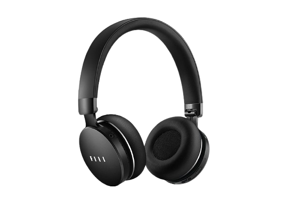
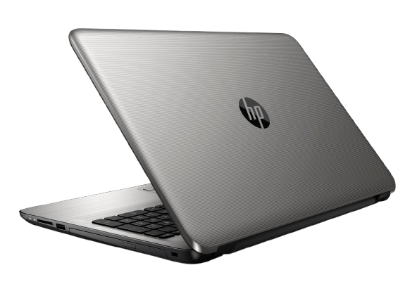
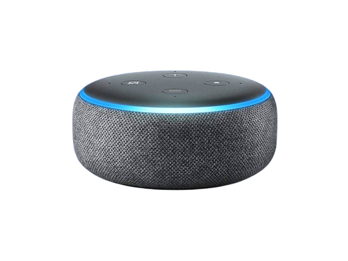
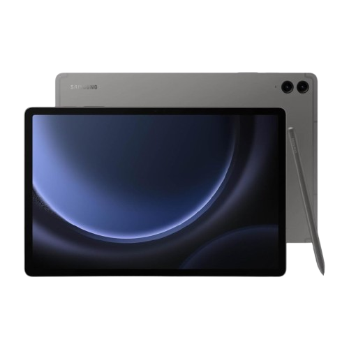
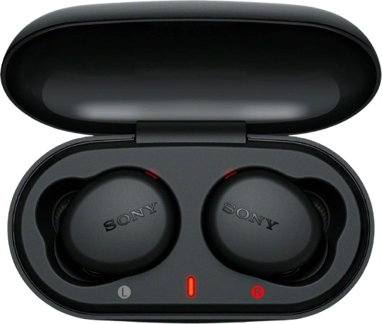
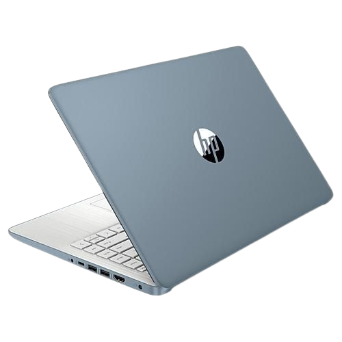

<!DOCTYPE html>
<html lang="es">
<head>
<meta charset="UTF-8">
<title>El Chispa Loca</title>

</head>
<body>

<h1>El Chispa Loca</h1>

<nav>
<a href="#">Inicio</a>
<a href="Acercade.html">Acerca de</a>
<a href="Contacto.html">Contacto</a>

Productos ▼

<a href="Celulares.html">Smartphones</a>
<a href="Laptos.html">Laptops</a>
<a href="Accesorios.html">Accesorios</a>
<a href="AudioyVideo.html">Audio y Video</a>
<a href="Hogar.html">Hogar</a>

</nav>

<h2>LO MÁS VENDIDO</h2>

<h3>Audifonos</h3>

Precio: $800.00

<button>Comprar</button>

<h3>Laptop HP</h3>

Precio: $5,000.00

<button>Comprar</button>

<h3>Alexa</h3>

Precio: $1000.00

<button>Comprar</button>

<h3>Reloj Inteligente</h3>

Precio: $700.00

<button>Comprar</button>

<h3>iPad</h3>

Precio: $9,000.00

<button>Comprar</button>

<h3>Audifonos Inalambricos Sony</h3>

Precio: $400.00

<button>Comprar</button>

<h3>Samsung S23 Ultra</h3>

Precio: $9,000.00

<button>Comprar</button>

<h3>Cargador Portatil</h3>

Precio: $750.00

<button>Comprar</button>

<h3>Iphone 13 3</h3>

Precio: $10,000.00

<button>Comprar</button>

<h3>Laptop HP</h3>

Precio: $13000.00

<button>Comprar</button>

<h2>Ofertas de Temporada</h2>

<footer>

&copy; 2024 EL CHISPA LOCA, S.A. DE C.V. TODOS LOS DERECHOS RESERVADOS.

</footer>
</body>
</html>
